# Backend Architecture Documentation

## Overview

The backend is a Spring Boot application implementing a tariff calculation and management system called TARIFFSHERIFF. It provides RESTful APIs for tariff calculations, user authentication, trade analytics, and administrative functions.

## Technology Stack

- **Framework**: Spring Boot 3.3.4
- **Language**: Java 17
- **Database**: PostgreSQL (hosted on AWS RDS)
- **ORM**: Spring Data JPA with Hibernate
- **Security**: Spring Security with JWT authentication
- **Documentation**: OpenAPI/Swagger
- **Build Tool**: Maven
- **External API**: Google Gemini AI for tariff summaries
- **PDF Generation**: OpenPDF library

## Project Structure

```
backend/
├── src/main/java/com/smu/tariff/
│   ├── TariffApplication.java          # Main Spring Boot application
│   ├── auth/                           # Authentication components
│   ├── ai/                             # AI integration (Gemini)
│   ├── config/                         # Configuration classes
│   ├── country/                        # Country entity and repository
│   ├── debug/                          # Debug controllers
│   ├── exception/                      # Exception handling
│   ├── logging/                        # Query logging system
│   ├── product/                        # Product category entities
│   ├── reference/                      # Reference data controllers
│   ├── security/                       # JWT and security services
│   ├── tariff/                         # Core tariff functionality
│   ├── trade/                          # Trade analytics
│   └── user/                           # User management
├── src/main/resources/
│   └── application.yml                 # Application configuration
└── pom.xml                            # Maven dependencies
```

## Database Connection and Configuration

### Database Configuration

- **Database**: PostgreSQL on AWS RDS
- **Connection URL**: `aws-csd-db.cpa8somwae85.ap-southeast-1.rds.amazonaws.com:5432/postgres`
- **JPA Configuration**:
  - DDL auto-update enabled (`ddl-auto: update`)
  - SQL logging enabled for development
  - Lazy loading optimized with `open-in-view: false`

### Key Configuration Classes

- **`SecurityConfig`** (`config/SecurityConfig.java:26`): Configures JWT-based authentication, CORS, and authorization rules
- **`CorsConfig`** (`config/CorsConfig.java:12`): Enables cross-origin requests from frontend
- **`SequenceInitializer`** (`config/SequenceInitializer.java:12`): Synchronizes database sequences on startup

## Core Components Architecture

### 1. Authentication & Security Layer

#### Components:

- **`AuthController`** (`auth/AuthController.java:23`): Handles login/register endpoints
- **`JwtService`** (`security/JwtService.java`): JWT token generation and validation
- **`JwtAuthFilter`** (`security/JwtAuthFilter.java`): Request filter for JWT authentication
- **`User`** (`user/User.java:22`): User entity implementing Spring Security UserDetails

#### Flow:

1. User credentials → `AuthController`
2. Authentication via `AuthenticationManager`
3. JWT token generation by `JwtService`
4. Token validation on subsequent requests via `JwtAuthFilter`

### 2. Core Tariff Management

#### Components:

- **`TariffController`** (`tariff/TariffController.java:29`): REST endpoints for tariff operations
- **`TariffService`** (`tariff/TariffService.java:43`): Business logic for calculations and CRUD operations
- **`TariffRateRepository`** (`tariff/TariffRateRepository.java:12`): Data access with custom queries
- **`TariffRate`** (`tariff/TariffRate.java:12`): Core entity for tariff data

#### Key Endpoints:

- `POST /api/tariffs/calculate`: Calculate tariff costs
- `GET /api/tariffs/rates`: Search tariff rates
- `POST /api/tariffs`: Admin-only tariff creation
- `PUT /api/tariffs/{id}`: Admin-only tariff updates
- `DELETE /api/tariffs/{id}`: Admin-only tariff deletion

### 3. Trade Analytics

#### Components:

- **`TradeAnalyticsController`** (`trade/TradeAnalyticsController.java:12`): Trade insights endpoint
- **`TradeAnalyticsService`** (`trade/TradeAnalyticsService.java:28`): Generates country-specific trade metrics
- **`TradeFlow`** (`trade/TradeFlow.java:16`): Entity for trade data (currently unused in analytics)

### 4. Reference Data Management

#### Components:

- **`ReferenceController`** (`reference/ReferenceController.java:19`): Provides country and product category lists
- **`Country`** (`country/Country.java:7`): Country entity with code and name
- **`ProductCategory`** (`product/ProductCategory.java:7`): Product category entity

### 5. Query Logging System

#### Components:

- **`QueryLogController`** (`logging/QueryLogController.java:24`): Query history endpoints
- **`QueryLogService`** (`logging/QueryLogService.java:22`): Logs user queries and results
- **`QueryLog`** (`logging/QueryLog.java:19`): Entity storing query history

### 6. AI Integration

#### Components:

- **`GeminiClient`** (`ai/GeminiClient.java:20`): Integration with Google Gemini AI for generating tariff summaries
- Used by `TariffService` to provide contextual explanations of tariff calculations

## Entity Relationships

### Core Entities and Relationships:

```
User (1) ←→ (*) QueryLog
    ↓
    User authentication and query tracking

TariffRate (*) → (1) Country [origin]
TariffRate (*) → (1) Country [destination]
TariffRate (*) → (1) ProductCategory
    ↓
    Defines tariff rates between country pairs for specific products

TradeFlow (*) → (1) Country [reporting]
TradeFlow (*) → (1) Country [partner]
TradeFlow (*) → (1) ProductCategory
    ↓
    Stores trade data (for future analytics enhancement)
```

### Key Constraints:

- **TariffRate**: Unique constraint on (origin, destination, product_category, effective_from)
- **User**: Unique constraints on username and email
- **Country/ProductCategory**: Unique constraints on code fields

## Frontend-Backend Connection

### Connection Architecture:

- **Protocol**: HTTP/HTTPS RESTful APIs
- **Base URL**: `http://localhost:8080` (development) or configured via `VITE_API_URL`
- **Authentication**: JWT Bearer token in Authorization header
- **Data Format**: JSON for all API communications

### Data Flow Architecture with DTOs

```mermaid
graph TB
    subgraph "Frontend (React)"
        FE[React Components]
        API[Axios API Client]
        AUTH[Auth Service]
    end

    subgraph "Backend (Spring Boot)"
        subgraph "Controller Layer"
            TC[TariffController]
            AC[AuthController]
            RC[ReferenceController]
            TAC[TradeAnalyticsController]
        end

        subgraph "DTO Layer"
            TRQ[TariffCalcRequest]
            TRS[TariffCalcResponse]
            TRD[TariffRateDto]
            ARQ[AuthRequest]
            ARS[AuthResponse]
            CTI[CountryTradeInsightsDto]
            ROD[ReferenceOptionDto]
        end

        subgraph "Service Layer"
            TS[TariffService]
            AS[AuthService]
            TAS[TradeAnalyticsService]
            QLS[QueryLogService]
        end

        subgraph "Entity/Repository Layer"
            TR[TariffRate Entity]
            U[User Entity]
            C[Country Entity]
            PC[ProductCategory Entity]
            TF[TradeFlow Entity]
            QL[QueryLog Entity]

            TRR[TariffRateRepository]
            UR[UserRepository]
            CR[CountryRepository]
            PCR[ProductCategoryRepository]
            TFR[TradeFlowRepository]
            QLR[QueryLogRepository]
        end
    end

    subgraph "Database (PostgreSQL)"
        DB[(PostgreSQL on AWS RDS)]
        TBL1[tariff_rate table]
        TBL2[users table]
        TBL3[country table]
        TBL4[product_category table]
        TBL5[trade_flow table]
        TBL6[query_log table]
    end

    subgraph "External Services"
        GEMINI[Google Gemini AI]
    end

    %% Frontend to Backend Communication
    FE -->|HTTP Requests with JWT| API
    API -->|POST /api/tariffs/calculate<br/>TariffCalcRequest JSON| TC
    API -->|POST /api/auth/login<br/>AuthRequest JSON| AC
    API -->|GET /api/reference/countries| RC
    API -->|GET /api/trade/insights?country=SGP| TAC

    %% Controller to DTO Processing
    TC -->|Validates & Maps| TRQ
    TC -->|Returns| TRS
    AC -->|Validates & Maps| ARQ
    AC -->|Returns| ARS
    RC -->|Returns| ROD
    TAC -->|Returns| CTI

    %% DTO to Service Layer
    TRQ -->|Business Logic| TS
    TS -->|Generates| TRS
    ARQ -->|Authentication| AS
    AS -->|JWT Generation| ARS

    %% Service to Entity/Repository
    TS -->|Query/Save| TRR
    TS -->|Lookup| CR
    TS -->|Lookup| PCR
    TS -->|Log Query| QLS
    AS -->|User Lookup| UR
    TAS -->|Analytics Query| TRR
    TAS -->|Country Data| CR

    %% Repository to Database
    TRR -->|JPA/Hibernate| TBL1
    UR -->|JPA/Hibernate| TBL2
    CR -->|JPA/Hibernate| TBL3
    PCR -->|JPA/Hibernate| TBL4
    TFR -->|JPA/Hibernate| TBL5
    QLR -->|JPA/Hibernate| TBL6

    %% Entity Relationships in Database
    TBL1 -.->|FK origin_id| TBL3
    TBL1 -.->|FK destination_id| TBL3
    TBL1 -.->|FK product_category_id| TBL4
    TBL6 -.->|FK user_id| TBL2
    TBL5 -.->|FK reporting_country_id| TBL3
    TBL5 -.->|FK partner_country_id| TBL3
    TBL5 -.->|FK product_category_id| TBL4

    %% External AI Integration
    TS -->|AI Summary Request| GEMINI
    GEMINI -->|HTML Summary| TS

    %% Return Path
    TRS -->|JSON Response| API
    ARS -->|JSON Response| API
    ROD -->|JSON Response| API
    CTI -->|JSON Response| API
    API -->|HTTP Response| FE

    %% Authentication Flow
    AUTH -->|Store JWT Token| API

    classDef frontend fill:#e1f5fe
    classDef dto fill:#f3e5f5
    classDef service fill:#e8f5e8
    classDef entity fill:#fff3e0
    classDef database fill:#fce4ec
    classDef external fill:#f1f8e9

    class FE,API,AUTH frontend
    class TRQ,TRS,TRD,ARQ,ARS,CTI,ROD dto
    class TS,AS,TAS,QLS service
    class TR,U,C,PC,TF,QL,TRR,UR,CR,PCR,TFR,QLR entity
    class DB,TBL1,TBL2,TBL3,TBL4,TBL5,TBL6 database
    class GEMINI external
```



### Key DTO Patterns:

1. **Request DTOs**: Incoming data from frontend (e.g., `TariffCalcRequest`, `AuthRequest`)
   - Validation annotations (`@NotBlank`, `@DecimalMin`)
   - Public fields for easy JSON deserialization

2. **Response DTOs**: Outgoing data to frontend (e.g., `TariffCalcResponse`, `AuthResponse`)
   - Calculated fields and processed data
   - AI-generated content (HTML summaries)

3. **Entity DTOs**: Representations of database entities (e.g., `TariffRateDto`)
   - Flattened entity data for frontend consumption
   - No sensitive information exposure

### Database Communication Patterns:

1. **Repository Layer**: Spring Data JPA interfaces with custom queries
2. **Entity Mapping**: JPA entities with proper relationships and constraints
3. **Transaction Management**: `@Transactional` for data consistency
4. **Connection Pooling**: HikariCP for efficient database connections

### Frontend Technology Stack:

- **Framework**: React 18.3.1 with Vite
- **HTTP Client**: Axios with request/response interceptors
- **Routing**: React Router DOM
- **UI**: Custom CSS with Framer Motion animations

### API Integration Points:

1. **Authentication Service** (`frontend/src/services/auth.js:1`):

   - Manages localStorage for token storage
   - Provides user role checking (`isAdmin()`, `isAuthed()`)

2. **API Service** (`frontend/src/services/api.js:6`):

   - Axios instance with automatic JWT token injection
   - Error handling and response formatting
   - Development logging for debugging

3. **Key Frontend-Backend Interactions**:

   - **Login/Register**: `POST /api/auth/login`, `POST /api/auth/register`
   - **Tariff Calculation**: `POST /api/tariffs/calculate`
   - **Reference Data**: `GET /api/reference/countries`, `GET /api/reference/product-categories`
   - **Trade Insights**: `GET /api/trade/insights?country={code}`
   - **Admin Operations**: CRUD operations on `/api/tariffs/*`
   - **Query Logs**: `GET /api/query-logs`

### Security Implementation:

- **CORS**: Configured to allow all origins in development (`CorsConfig.java:16`)
- **JWT**: Stateless authentication with configurable expiration (24 hours default)
- **Authorization**: Role-based access control (USER, ADMIN roles)
- **Protected Routes**: Frontend route protection based on authentication status and user roles

### Data Flow:

1. **Frontend Request** → Axios interceptor adds JWT token
2. **Backend Security Filter** → JWT validation via `JwtAuthFilter`
3. **Controller Layer** → Role-based authorization via `@PreAuthorize`
4. **Service Layer** → Business logic execution
5. **Repository Layer** → Database interaction via Spring Data JPA
6. **Response** → JSON serialization back to frontend

## Component Responsibilities

### Configuration Layer (`config/`)

- **Security configuration**: JWT setup, CORS, authentication rules
- **Database setup**: Connection pooling, JPA configuration
- **Application initialization**: Sequence synchronization, startup tasks

### Controller Layer (`*Controller.java`)

- **Request validation**: Input validation using `@Valid` annotations
- **Authorization**: Role-based endpoint protection
- **Response formatting**: Consistent JSON response structure
- **Error handling**: Delegated to global exception handler

### Service Layer (`*Service.java`)

- **Business logic**: Core application functionality
- **Transaction management**: `@Transactional` for data consistency
- **External integrations**: AI service calls, PDF generation
- **Query logging**: Automatic logging of user activities

### Repository Layer (`*Repository.java`)

- **Data access**: JPA repository interfaces
- **Custom queries**: Complex search and filtering operations
- **Database optimization**: Efficient querying with proper indexing

### Entity Layer (`*.java` entities)

- **Data modeling**: JPA entities with proper relationships
- **Validation constraints**: Database-level and application-level validation
- **Audit fields**: Creation timestamps and user tracking

### Exception Handling (`exception/`)

- **Global exception handler**: Centralized error response formatting
- **Custom exceptions**: Domain-specific error types
- **Error response standardization**: Consistent error message structure

## External Dependencies

### Database:

- **PostgreSQL on AWS RDS**: Production database with automated backups
- **Connection pooling**: HikariCP (Spring Boot default)
- **Migration strategy**: JPA schema auto-update for development

### AI Integration:

- **Google Gemini API**: Generates contextual tariff explanations
- **API Key management**: Configured via environment variables
- **Error handling**: Graceful fallback when AI service unavailable

### Documentation:

- **OpenAPI/Swagger**: Auto-generated API documentation
- **Endpoint**: `http://localhost:8080/swagger-ui/index.html`

### Security:

- **JWT Token**: HMAC-based signing with configurable secret
- **Password encoding**: BCrypt for secure password storage
- **Session management**: Stateless design for scalability

This architecture provides a robust, scalable foundation for the tariff management system with clear separation of concerns, proper security implementation, and efficient data access patterns.
